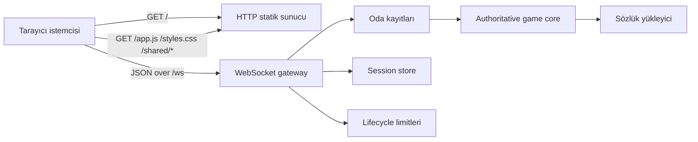
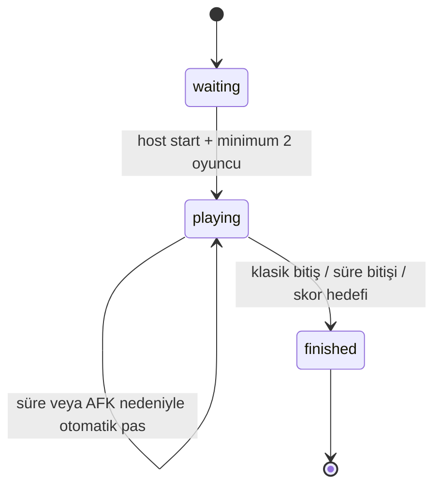

# Kelime Meydanı

Kelime Meydanı; Scrabble benzeri, Türkçe kelime odaklı, tarayıcıdan oynanan çok oyunculu kelime tahtası oyunudur. Uygulama tek bir Node.js sunucu süreciyle çalışır. Tarayıcı istemcileri statik dosyaları HTTP üzerinden alır, oyun durumunu ise aynı origin üzerindeki `/ws` WebSocket bağlantısıyla senkronize eder.

Proje harici npm bağımlılığı olmayan, LAN veya kısa süreli online oyun oturumları için tasarlanmış bir prototiptir. Oyun durumunun yetkili kaynağı sunucudur; istemci yalnızca kullanıcı etkileşimini toplar ve sunucudan gelen state snapshot'ını render eder.

## Özellikler

- 15x15 özel premium yerleşimli kelime tahtası.
- 2-10 oyunculu oda modeli.
- Oda sahibi tarafından yönetilen oyun başlatma ve ayar akışı.
- Klasik, hızlı 15 dakika, hızlı 30 dakika ve 250 puan hedefli oyun modları.
- 60, 90 veya 120 saniyelik hamle süresi.
- Sunucu tarafında doğrulanan hamle, pas ve taş değiştirme işlemleri.
- Türkçe harf dağılımı, joker taş ve Türkçe karakter normalizasyonu.
- Sıkı sözlük modu ile sözlükte olmayan kelimeleri reddetme.
- Her oyuncuya yalnızca kendi rafını gösteren state serileştirme.
- Reconnect desteği için session tabanlı yeniden bağlanma akışı.
- WebAudio tabanlı etkileşim sesleri; harici ses dosyası yok.
- Responsive üç panelli oyun ekranı: sol kontrol paneli, orta tahta, sağ skor/geçmiş paneli.
- Temel HTTP, WebSocket, lifecycle ve sözlük kontrolleri için test kapsamı.

## Gereksinimler

- Node.js 20 veya üzeri.
- Modern tarayıcı.
- LAN veya online kullanım için oyuncuların sunucuya erişebileceği ağ bağlantısı.

## Hızlı Başlangıç

```powershell
npm start
```

Geliştirme için aynı sunucuyu başlatan alternatif komut:

```powershell
npm run dev
```

Tarayıcıdan aç:

```text
http://localhost:3000
```

Varsayılan çalışma ayarları:

| Ayar | Varsayılan | Açıklama |
|---|---:|---|
| `HOST` | `0.0.0.0` | Sunucunun dinleyeceği ağ arayüzü. |
| `PORT` | `3000` | HTTP ve WebSocket portu. |
| `STRICT_DICTIONARY` | açık | `0` verilirse sözlük dışı kelimelere izin veren esnek mod açılır. |

Örnek özel port:

```powershell
$env:PORT="8080"; npm start
```

Geçici esnek sözlük modu:

```powershell
$env:STRICT_DICTIONARY="0"; npm start
```

Sağlık kontrolü:

```text
GET /health
```

`/health`, aktif oda sayısını, bağlantı sayısını, session sayısını, sözlük modunu ve sözlük istatistiklerini döndürür.

## Arkadaşlarla Oynatma

### LAN

Aynı ağdaki oyuncular sunucuyu çalıştıran cihazın IP adresini kullanır:

```text
http://<sunucu-ip>:3000
```

### Geçici online yayın

Kısa süreli online oyun için Cloudflare Quick Tunnel kullanılabilir:

```powershell
npm start
```

Ayrı terminalde:

```powershell
cloudflared tunnel --url http://localhost:3000
```

`trycloudflare.com` linkini yalnızca oynayacak kişilerle paylaş. Oyun bittiğinde hem sunucuyu hem de tunnel sürecini kapat. Quick Tunnel geçici URL üretir ve uptime garantisi vermez.

Windows shell `cloudflared` komutunu hemen görmezse kurulum yolundaki exe doğrudan çalıştırılabilir:

```powershell
& "$env:LOCALAPPDATA\Microsoft\WinGet\Packages\Cloudflare.cloudflared_Microsoft.Winget.Source_8wekyb3d8bbwe\cloudflared.exe" tunnel --url http://localhost:3000
```

Kalıcı online kullanımda Quick Tunnel yerine Cloudflare named tunnel veya benzer kontrollü reverse proxy yaklaşımı daha uygundur.

## Mimari



### Tasarım kararları

| Karar | Gerekçe | Trade-off |
|---|---|---|
| Oyun state'i sunucuda tutulur | Hileyi ve client tutarsızlığını azaltır | Sunucu restart edilirse aktif odalar kaybolur |
| Harici npm bağımlılığı yok | Kurulum ve taşınabilirlik basit kalır | WebSocket protokolü proje içinde yönetilir |
| Statik client + WebSocket | LAN ve tunnel üzerinden hızlı çalışır | Çoklu instance desteği yoktur |
| Session tabanlı reconnect | Bağlantı kopmalarında oyuncu aynı public kimlikle dönebilir | Session'lar process belleğine bağlıdır |
| Sıkı sözlük modu | Uydurma kelimeleri engeller | Sözlük kalitesi oyun deneyimini doğrudan belirler |

### Runtime state

Sunucu belleğinde tutulan ana kayıtlar:

- `rooms`: aktif oda ve oyun state'i.
- `connections`: açık WebSocket bağlantıları.
- `sessionStore`: reconnect session kayıtları.
- `dictionary`: yüklenmiş oynanabilir kelime seti.

Kalıcı veritabanı yoktur. Bu nedenle proje tek process, küçük ölçekli ve geçici oturum odaklıdır.

## Proje Yapısı

```text
.
├── data/
│   └── dictionary.tr.txt
├── public/
│   ├── assets/
│   │   └── board-emblem.svg
│   ├── app.js
│   ├── index.html
│   └── styles.css
├── scripts/
│   └── check-dictionary.js
├── server/
│   ├── dictionary.js
│   ├── index.js
│   ├── lifecycle-limits.js
│   ├── sessions.js
│   ├── static-paths.js
│   └── websocket-protocol.js
├── src/
│   └── shared/
│       ├── client-logic.js
│       └── game-core.js
├── test/
│   ├── client-logic.test.js
│   ├── game-core.test.js
│   ├── lifecycle-limits.test.js
│   ├── server-integration.test.js
│   ├── session-store.test.js
│   ├── static-paths.test.js
│   └── websocket-protocol.test.js
├── package.json
└── README.md
```

### Bileşen sorumlulukları

| Dosya | Sorumluluk |
|---|---|
| `server/index.js` | HTTP server, WebSocket upgrade, oda yönetimi, broadcast, lifecycle kontrolleri. |
| `server/websocket-protocol.js` | WebSocket handshake, frame parse/encode ve close frame üretimi. |
| `server/dictionary.js` | Sözlük okuma, Türkçe kelime normalizasyonu, metadata ve flag politikası. |
| `server/sessions.js` | Reconnect session üretimi, doğrulama, TTL ve oda bazlı temizlik. |
| `server/lifecycle-limits.js` | IP/subnet bağlantı sınırları, oda oluşturma limiti ve idle room pruning. |
| `server/static-paths.js` | Public/shared statik dosya çözümü ve kök dışına çıkmayı engelleme. |
| `src/shared/game-core.js` | Tahta, taş torbası, oyuncular, puanlama, sıra, modlar ve hamle doğrulama. |
| `src/shared/client-logic.js` | Client tarafı saf yardımcı fonksiyonlar. |
| `public/app.js` | Tarayıcı state'i, render, WebSocket bağlantısı, drag/drop, ses ve localStorage. |
| `public/index.html` | Join ekranı, oyun alanı, kontroller, skorboard ve geçmiş yapısı. |
| `public/styles.css` | Responsive layout, tahta/raf görselliği, animasyon ve reduced-motion desteği. |

## Oyun Akışı



## Oyun Kuralları

- Oyun en az 2 oyuncuyla başlar.
- Oda kapasitesi en fazla 10 oyuncudur.
- Her oyuncunun rafı 7 taşa tamamlanır.
- İlk hamle merkez karesinden geçmelidir.
- Sonraki hamleler mevcut kelime ağına temas etmelidir.
- Bir hamlede oynanan taşlar aynı satırda veya aynı sütunda olmalıdır.
- Oynanan taşlar arasında boşluk bırakılamaz.
- En az 2 harfli kelime oluşmalıdır.
- Çapraz oluşan kelimeler de doğrulanır ve puanlanır.
- Sıkı sözlük modunda oluşan her kelime sözlükte bulunmalıdır.
- Joker taş geçerli bir Türkçe harfe dönüştürülür ve 0 puan değerindedir.

### Puanlama

Premium kareler:

| Kod | Anlam |
|---|---|
| `DL` | Harf x2 |
| `TL` | Harf x3 |
| `DW` | Kelime x2 |
| `TW` | Kelime x3 |

- Premium etkiler yalnızca yeni oynanan taşlar için uygulanır.
- 7 taş tek hamlede oynanırsa 35 puan bonus eklenir.
- Klasik bitişte elde kalan taş puanları oyunculardan düşülür.
- Rafını bitiren oyuncuya diğer raflarda kalan toplam puan eklenir.

### Modlar

| Mod | Değer | Bitiş koşulu |
|---|---|---|
| Klasik | `classic` | Torba/raf bitişi veya arka arkaya pas sınırı. |
| Hızlı 15 dk | `timed15` | 15 dakika sonunda mevcut skorlarla biter. |
| Hızlı 30 dk | `timed30` | 30 dakika sonunda mevcut skorlarla biter. |
| Puan hedefi 250 | `score250` | Bir oyuncu 250 puana ulaşınca biter. |

### Sıra ve bağlantı davranışı

- Hamle süresi 60, 90 veya 120 saniye seçilebilir.
- Varsayılan hamle süresi 90 saniyedir.
- Süre dolarsa sunucu otomatik pas uygular.
- Sırası gelen oyuncu bağlantı kaybederse 15 saniyelik AFK toleransı başlar.
- Oyuncu tolerans süresi içinde reconnect olursa sırasını korur.
- Tolerans süresi dolarsa sunucu otomatik pas uygular.

## WebSocket Mesaj Sözleşmesi

Endpoint:

```text
/ws
```

Client mesaj tipleri:

| Type | Amaç | Önemli alanlar |
|---|---|---|
| `join` | Oda oluşturma veya odaya katılma | `name`, `roomCode`, session alanları |
| `settings` | Oyun başlamadan mod/süre ayarı | `gameMode`, `turnSeconds` |
| `start` | Oyunu başlatma | Sadece host |
| `move` | Taş yerleştirme hamlesi | `placements[]` |
| `pass` | Pas geçme | Ek alan yok |
| `exchange` | Seçili taşları değiştirme | `tileIds[]` |

Server mesaj tipleri:

| Type | Amaç |
|---|---|
| `joined` | Oda kodu ve reconnect bilgilerini bildirir. |
| `state` | Oyunun yetkili snapshot'ını gönderir. |
| `error` | Reddedilen işlem için hata kodu ve mesaj döndürür. |

State snapshot ilkeleri:

- `me.rack` yalnızca ilgili oyuncuya gönderilir.
- Diğer oyuncular için yalnızca `rackCount` paylaşılır.
- Client'a internal player id yerine public oyuncu kimliği gönderilir.
- `revision`, client'ın eski bekleyen yerleştirmeleri temizlemesine yardımcı olur.

## Sözlük Sistemi

Sözlük dosyası:

```text
data/dictionary.tr.txt
```

Desteklenen formatlar:

```text
KELİME
word<TAB>source<TAB>license<TAB>minLength<TAB>flags
KELİME<TAB>local-user<TAB>user-provided<TAB>2<TAB>allowed
```

Düz satırlar geriye uyumludur ve şu varsayılanlarla kabul edilir:

| Alan | Varsayılan |
|---|---|
| `source` | `local-user` |
| `license` | `user-provided` |
| `minLength` | `2` |
| `flags` | `allowed` |

Desteklenen flag değerleri:

- `allowed`
- `proper_noun`
- `abbreviation`
- `archaic`
- `slang`

Varsayılan politika:

- Özel isimler reddedilir.
- Kısaltmalar reddedilir.
- Arkaik veya argo kelimeler yalnızca `allowed` ile açıkça işaretlenirse oynanabilir.
- Türkçe çekimli formlar otomatik üretilmez; oynanabilir olması için dosyada yer almalıdır.
- Sıkı sözlük modu açıkken sözlük boşsa sunucu başlamaz.

Sözlük kontrolü:

```powershell
node scripts/check-dictionary.js
```

## Güvenlik ve Dayanıklılık

- Sunucu; puan, sıra, raf, torba ve tahta state'i için yetkili kaynaktır.
- Client'tan gelen hamleler sunucuda yeniden doğrulanır.
- Oyuncu yalnızca kendi sırası geldiğinde hamle yapabilir.
- Raf sahipliği sunucu tarafında kontrol edilir.
- WebSocket yalnızca `/ws` path'i için kabul edilir.
- Aynı origin dışı WebSocket origin değerleri reddedilir.
- WebSocket mesaj boyutu, mesaj frekansı ve bağlantı sayısı sınırlandırılır.
- Oda oluşturma sayısı IP bazında sınırlandırılır.
- Boşta kalan odalar ve süresi dolan session'lar periyodik olarak temizlenir.
- Static file resolver public/shared kökleri dışına çıkmaz.
- Statik cevaplara temel güvenlik başlıkları eklenir.

## Test ve Kalite Kontrolleri

Tüm testler:

```powershell
npm test
```

Sözdizimi, sözlük ve test kalite kapısı:

```powershell
npm run check
```

Release öncesi aynı kontrol:

```powershell
npm run check:release
```

`npm run check` şunları kapsar:

- Sunucu, shared ve client dosyaları için `node --check`.
- Sözlük veri kontratı kontrolü.
- Unit testler.
- HTTP/WebSocket entegrasyon testleri.

Test kapsamı:

| Test dosyası | Kapsam |
|---|---|
| `game-core.test.js` | Oyun başlatma, private raflar, merkez şartı, hamle doğrulama, sözlük, modlar, süre, AFK, oyuncu sınırı. |
| `client-logic.test.js` | Oda kodu, join payload, reconnect auto-join, joker harf inputu, timer gösterimi. |
| `websocket-protocol.test.js` | Handshake, frame parse/encode, hatalı frame reddi, payload limiti. |
| `server-integration.test.js` | HTTP güvenlik başlıkları, statik dosyalar, WebSocket akışı, rate limit, reconnect, oda kapasitesi. |
| `lifecycle-limits.test.js` | IP/subnet limitleri, sliding window limiter, oda pruning, IP normalizasyonu. |
| `session-store.test.js` | Reconnect credential doğrulama, TTL ve oda session temizliği. |
| `static-paths.test.js` | Malformed path, public/shared route çözümü ve traversal engeli. |

## Dağıtım Notları

Bu yapı şu senaryolar için uygundur:

- Aynı ağda arkadaşlarla LAN oyunu.
- Kısa süreli online oyun oturumu.
- Kişisel bilgisayar veya küçük VPS üzerinde geçici yayın.
- Türkçe kelime oyunu prototipi geliştirme.

Kalıcı ve herkese açık servis hedeflenirse yeniden ele alınması gereken başlıklar:

- Oda state'inin process belleği yerine kalıcı veya dağıtık state katmanına taşınması.
- Çoklu sunucu instance için sticky session veya merkezi state senkronizasyonu.
- Reconnect session kayıtlarının process dışına alınması.
- Gözlemleme, metrik, log ve alarm altyapısı.
- Oda moderasyonu ve kullanıcı yönetimi.
- Sözlük kaynağı, lisans ve veri yönetişimi.
- Reverse proxy ve TLS terminasyon modelinin netleştirilmesi.

## Bilinen Sınırlar

- Sunucu yeniden başlarsa aktif odalar ve session'lar silinir.
- Çoklu instance desteği yoktur.
- Sözlük morfolojik çözümleme yapmaz.
- Quick Tunnel geçici URL üretir ve uptime garantisi vermez.
- Bot oyuncu, izleyici modu, hesap sistemi, kalıcı skor geçmişi ve oda listesi yoktur.
- WebSocket protokolü minimal tutulmuştur; compression ve fragmented frame desteği yoktur.

## Katkı Akışı

1. Değişiklikten önce `npm run check` çalıştır.
2. Oyun kuralı değiştiriyorsan `game-core.test.js` kapsamını güncelle.
3. WebSocket payload sözleşmesini değiştiriyorsan README'deki ilgili tabloyu güncelle.
4. Sözlük dosyasını değiştiriyorsan `node scripts/check-dictionary.js` çıktısını kontrol et.
5. Güvenlik sınırlarını etkileyen değişikliklerde integration test ekle.
